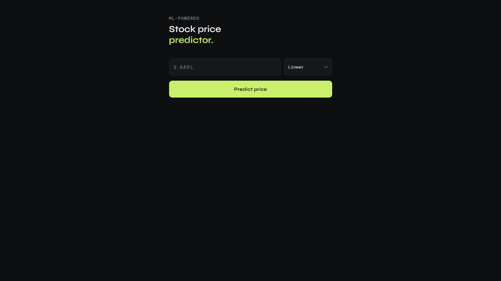
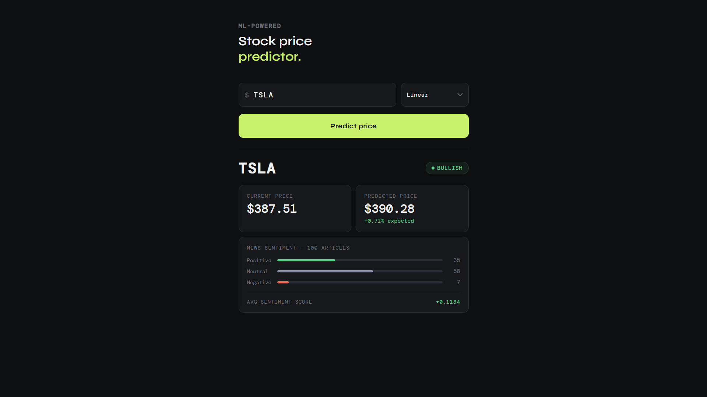

# 📈 Stock Price Prediction System with Sentiment Analysis

## 🚀 Overview

This project predicts stock prices using machine learning models and enhances predictions by incorporating sentiment analysis from financial news.

The system fetches historical stock data with real-time news sentiment to improve prediction accuracy and provide deeper market insights.

---

## 🔥 Key Features

* 📊 Stock price prediction using Machine Learning
* 📰 News scraping and sentiment analysis
* 💬 Sentiment classification (Positive / Negative / Neutral)
* ⚙️ Modular ML pipeline
* 📉 Model evaluation using R², RMSE, MAE

---

## 🧠 Tech Stack

* Python
* Pandas, NumPy
* Scikit-learn
* yFinance API
* NLP (VADER)
* Matplotlib

---

## 🏗️ System Architecture

1. Data Collection (yFinance + News scraping)
2. Data Preprocessing & Feature Engineering
3. Sentiment Analysis on news headlines
4. Model Training (Linear Regression, etc.)
5. Prediction Pipeline
6. Backend API (FastAPI)
7. Frontend UI

---

## 📂 Project Structure

```
backend/
frontend/
ml_pipeline/
sentiment/
tests/
```

---

## ▶️ How to Run

### 1️⃣ Clone the Repository

```bash
git clone https://github.com/YOUR_USERNAME/stock-price-prediction-sentiment-analysis.git
cd stock-price-prediction-sentiment-analysis
```

### 2️⃣ Create Virtual Environment (Recommended)

```bash
python -m venv venv
venv\Scripts\activate   # For Windows
```

### 3️⃣ Install Dependencies

```bash
pip install -r requirements.txt
```

### 4️⃣ Run Backend (FastAPI Server)

```bash
uvicorn backend.app:app --reload
```

Backend will run at:

```
http://127.0.0.1:8000
```

### 5️⃣ Open Frontend

Open the HTML file from the `frontend/` folder in your browser.

---

## 📸 Output Preview

### 🖥️ User Interface



### 📊 Prediction Output



---

## 📌 Future Improvements

* Deployment using Docker
* Advanced NLP models (BERT)
* Long-term predictions
* Buy/Sell signal generation

---

## 👨‍💻 Author

Abhay Patil
